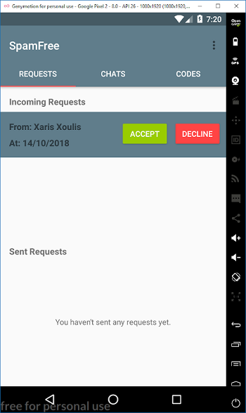
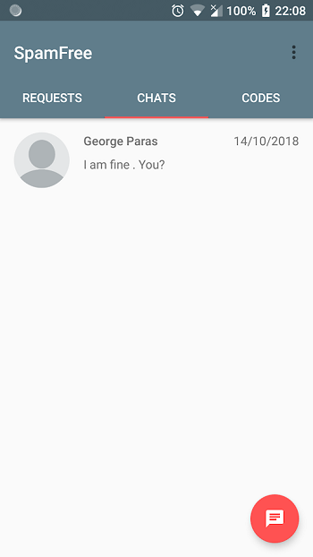
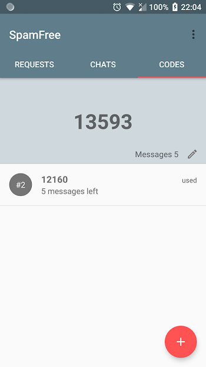
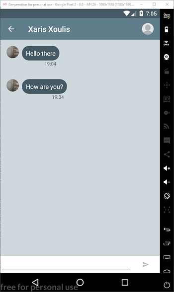

# SpamFree

Tired of being stuck in a conversation with someone that you only wanted to exchange few messages? Did a new friend/colleague asked for a way to contact you, but you really don't want to give away your email address or your phone number? Do you want to take part in a contest, but only want to be hear back if you win? Well, fear not because <b>SpamFREE</b> is here!!! 

<b>SpamFREE</b> solves all of the above problems, by giving the full potential of a messaging app, but for only a specified (completely set by you) number of messages.Forget all the previous hassle that someone, you don't know so well, will start spamming you out of the blue. Put an end to the annoying interruptions of your so significant life!

___

With **SpamFREE** you can:
* Send and receive messages, up to a specified limit
* Update your status
* Sign in with your google account or just a regular email
* Receive real-time notifications
* Accept or reject chat requests
* Create new codes and share them with your friends

Screenshots
---
   

External Services used
---
* [Firebase Cloud Functions](https://firebase.google.com/docs/functions/)
* [Firebase Realtime Database](https://firebase.google.com/docs/database/)
* [Firebase Cloud Storage](https://firebase.google.com/docs/storage/)
* [Firebase Authentication](https://firebase.google.com/docs/auth/)
* [Firebase Cloud Messaging](https://firebase.google.com/docs/cloud-messaging/)

Libraries used
---
* [DataBinding](https://developer.android.com/topic/libraries/data-binding/)
* [Architecture Components](https://developer.android.com/topic/libraries/architecture/)
* [FirebasUI](https://github.com/firebase/FirebaseUI-Android)
* [MaterialRatingBar](https://github.com/DreaminginCodeZH/MaterialRatingBar)
* [Picasso](https://github.com/square/picasso)
* [CircleImageView](https://github.com/hdodenhof/CircleImageView)
* [ImageCropper](https://github.com/ArthurHub/Android-Image-Cropper)

---
#### Developed as part of my thesis, University of Piraeus, Computer Science Department
